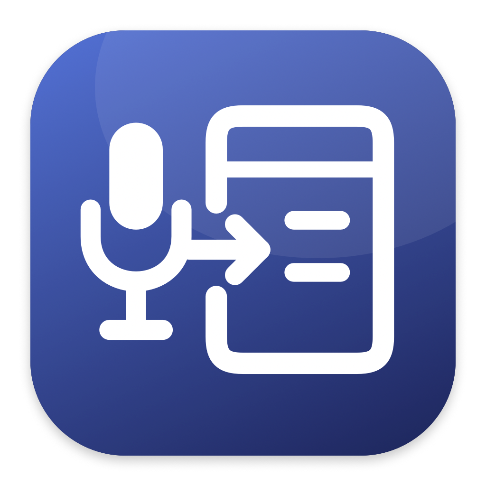

<p></p>

# Remote Dictate Helper

Dictate on your Mac. Paste into a remote computer through **Apple Screen Sharing**
or **Microsoft Windows App** (formerly Microsoft Remote Desktop).

[Product website](https://elyrix-systems.com/remote-dictate-helper/) ·
[Elyrix Systems](https://elyrix-systems.com)

Remote Dictate Helper is a small, open-source macOS menu bar app for clipboard-based
voice dictation. Your microphone and dictation app stay on the local Mac.
The helper needs no installation on the remote computer.

**Supported remote clients:** Apple Screen Sharing and Microsoft Windows App (RDP).
Windows App support starts with 1.1.0.

**Dictation apps:** Wispr Flow, superwhisper and Valis are included by default.
Add other clipboard-based dictation apps through **Settings → Add App**. The same
selected app list and paste handling apply to both remote clients, without
vendor-specific adapters.

The dictation app must put its result on the local clipboard and send **Command+V**.
Direct typing, Accessibility insertion and other remote clients use different
mechanisms and are outside this integration.

Released under the [MIT license](LICENSE).
Primary maintainer: **[@pradaev](https://github.com/pradaev)**.
This project is not affiliated with or endorsed by the dictation app vendors.

## How it works

A dictation app usually places its result on the local clipboard, sends Command+V,
and restores what you had copied before. In Screen Sharing, that synthetic paste
can reach the remote Mac before the clipboard does, sometimes leaving a stray `v`.

Remote Dictate Helper coordinates that handoff. The two remote clients use
different clipboard protocols. The choice depends on the active remote client,
not which dictation app produced the paste. Shared regression tests cover source
selection and both client paths; [integration records](docs/behavior-baseline.md)
keep the details of physical validation.

### Apple Screen Sharing

1. While Screen Sharing is active, it keeps a short, in-memory snapshot history
   of the local clipboard.
2. It intercepts a paste from one of your configured dictation apps and captures
   the actual clipboard contents, including text formatting. It does not read
   the app's transcript history or listen to your microphone.
3. After the dictation app releases its clipboard, it temporarily turns off
   shared clipboard synchronization and uses Screen Sharing's **Send Clipboard**
   to transfer the captured contents to the remote Mac.
4. It sends **one Command+V** to the same Screen Sharing window. It never sends
   Backspace or deletes a character.
5. It restores your original local clipboard, sends that restored clipboard to
   the remote connection and turns shared clipboard synchronization back on.

### Microsoft Windows App

Windows App can receive a dictation app's synthetic Command+V as a plain `v`,
even when physical Command+V and RDP clipboard redirection work.

1. The helper intercepts the selected dictation app's paste in the active
   Windows App window.
2. It prepares the current local clipboard text and waits for physical modifiers
   to be released while the original window, input and clipboard remain current.
3. It briefly moves focus to a transparent helper window and back to the same
   Windows App window. This refreshes the client before paste; a slight focus
   flicker may be visible. A changed destination or clipboard cancels the paste.
4. It sends one complete native Command+V sequence, including Command press and
   release events and device-specific modifier flags. It never sends Backspace.

RDP handles clipboard redirection. This path **does not write the clipboard or
change Windows App settings**. Your dictation app remains responsible for keeping
or restoring your previous clipboard. Enable its restore/keep-clipboard option.

The helper reacts to the **paste**, not the recording shortcut. Hold-to-talk,
double-tap and toggle recording remain features of your dictation app; configure
them there. Manual paste and dictation into local applications are left alone.

You may switch windows while recording and return to the remote field before
stopping. Once the helper captures a paste, changing focus, clicking or typing
before replay cancels that insertion. It will not paste later when you return. A new copy takes precedence
over restoring an old clipboard. **Done** in the helper’s menu means local processing finished;
Neither remote client provides the helper with confirmation that the remote
field consumed it. In Windows App, **Done** means the paste keys were sent; it
does not claim the dictation app has restored its clipboard.

## Installation

### Download the app

Get the DMG from the [latest stable release](https://github.com/elyrix-systems/remote-dictate-helper/releases/latest).
**Apple silicon only** (M1 or later) running **macOS 26+**.

1. Open the DMG and drag **Remote Dictate Helper.app** to **Applications**.
2. Eject the disk image, then open the installed app from Applications.
3. In **Settings**, grant Accessibility and choose your dictation apps. List changes save automatically.

**Stable downloads are currently not Apple notarized.** They are ad-hoc signed, not signed
with an Apple Developer ID. macOS may block the first launch. If you have reviewed
the source/release and trust it, use **System Settings → Privacy & Security →
Open Anyway**, where available. Follow [Apple’s instructions](https://support.apple.com/en-us/102445).
Managed Macs may prohibit this. Do not disable Gatekeeper, remove quarantine with
terminal commands or install a self-signed publisher certificate.

Each DMG includes a SHA-256 checksum to check download integrity. A checksum does
not independently authenticate its publisher. A future release explicitly marked
**Developer ID signed and Apple notarized** will provide the normal downloaded-app
opening experience. Accessibility approval is still required.

To update, quit the helper from its menu, wait for it to finish clipboard cleanup,
and replace it in Applications. Settings remain in your user Library. Ad-hoc
updates may need Accessibility to be granted again. There is no automatic updater.

### Build from source

Requires **macOS 26+**, **Swift 6+** from Apple Command Line Tools or Xcode,
and **Python 3** for the build and installation tools. Install Apple's tools with
`xcode-select --install` if needed. No third-party Swift or Python packages are used.

```zsh
: "Computer: Local Mac | Account: $USER"
git clone https://github.com/elyrix-systems/remote-dictate-helper.git
cd remote-dictate-helper
make install
```

This one command creates or reuses a **local signing identity**, builds an
optimized app, installs it in `~/Applications` and opens Settings on first launch. macOS may ask you
to allow creation/use of the local key. That identity is only for your own
rebuilds and keeps Accessibility grants stable; it is not Apple notarization.
Never share the private key. For an explicitly ad-hoc development build, use
`REMOTE_DICTATE_CODESIGN_IDENTITY=- make build`; a missing named certificate
otherwise stops the build.

Version 0.8.0 introduces the app identifier `systems.elyrix.RemoteDictateHelper`
and a new local signing identity. On the first upgrade from an earlier version,
grant Accessibility again in Settings. Your saved dictation app selection is retained.

Quit any running helper normally before reinstalling. Replaced bundles are kept
under `.local-audit/install-backups` in your checkout. Dictation apps are untouched.
For development checks, run:

```zsh
: "Computer: Local Mac | Account: $USER"
make test
make privacy-scan
REMOTE_DICTATE_CODESIGN_IDENTITY=- make build
```

See [release packaging](docs/distribution.md) for DMG builds and future Developer
ID signing, and [contributing](CONTRIBUTING.md) to submit a change.

## First use

1. Open the remote client on the local Mac. In Apple Screen Sharing, enable
   **Edit → Use Shared Clipboard**. In Windows App, enable clipboard redirection
   from the local device to the remote session; see
   [Microsoft's clipboard settings](https://learn.microsoft.com/en-us/windows-app/device-audio-folder-redirection-teams).
   Check ordinary local copy and manual Command+V in a remote field first.
   Remote Windows also accepts its native Control+V. The helper cannot bypass
   an administrator's clipboard policy.
2. Launch Remote Dictate Helper. Its single **Settings** window includes Accessibility
   and the dictation app list. Grant Accessibility in
   **System Settings → Privacy & Security → Accessibility** when requested. The
   helper checks the grant when you return; you can reopen **Settings…** from its
   microphone-and-window menu bar icon at any time. No Microphone, Screen Recording,
   Full Disk Access or System Events Automation permission is requested by this app.
3. In that same window, choose your dictation apps. Changes save immediately. Wispr Flow,
   superwhisper and Valis are included for new
   installations. Use **Add App…** or **Remove** to manage your dictation apps.
   Existing source selections are preserved on upgrade. Close the window when
   finished; there are no Save or Cancel buttons. If a change cannot be saved,
   the previous list remains and the helper shows an error.
4. In your dictation app, use clipboard-based paste and keep/restore your previous
   clipboard. In superwhisper, use **Paste result text** and **Keep what I have
   copied**. Other insertion methods may bypass the helper.
5. Click the remote text field and dictate with your usual shortcut. Stay in the
   field until **Done** appears in the helper’s menu before the next dictation.

The helper works automatically while running; there is no enable switch, paste
method selector or pause mode. On its first launch from `/Applications` or
`~/Applications`, it registers to **launch at login**. Settings shows the current
status and an **Open Login Items…** button. If macOS requests approval, allow it in
**System Settings → General → Login Items & Extensions**. You can turn it off
there; restarting or updating the helper will not turn it back on. Choose **Quit**
to stop the current session. Copies launched from a disk image or build folder
do not register for login.

Adding an app allows its paste events; it does not establish compatibility. An
app must emit an identifiable Command+V with clipboard content. Direct text
insertion or simulated character typing is a different protocol.

## Troubleshooting

- **Nothing arrives remotely:** first repeat the ordinary copy/paste check and
  confirm clipboard sharing/redirection is enabled in the selected remote client.
  Confirm the dictation app is
  listed in Settings and configured to paste via the clipboard.
- **Error in the menu:** open the helper’s menu for the error. Open **Settings**
  to check Accessibility and grant it if needed. If macOS disabled the event filter, quit and
  reopen the helper. Do not retry a failed paste blindly; check the remote field.
- **Waiting to restore:** return to the original Screen Sharing connection so
  clipboard cleanup can finish. Quit also lets pending restoration finish.
- **Screen Sharing clipboard release timeout:** enable restoration in your dictation app. For
  an app deliberately configured to leave its transcript, quit the helper and
  set that source's `clipboardReturn` to `keepsTranscript` in the settings file,
  then reopen it. The default is `restoresPrevious`; this is an explicit app
  contract, not a delay setting. Windows App does not use that release protocol;
  it repairs the paste while the current transcript is still in the clipboard.
- **Permission disappears after rebuilding:** use the same local signing
  identity; see [local signing](docs/distribution.md#installation-paths). Ad-hoc
  updates change code identity: an enabled old entry can remain while the new
  app shows Not granted. Remove that old entry with **−**, then click the
  helper's **Open Accessibility Settings…** and allow the installed copy again.
  Switching from ad-hoc to certificate signing also needs a fresh grant once.
  No System Events Automation permission is required by this version.

Settings: `~/Library/Application Support/RemoteDictateHelper/settings.json`.
Operational log: `~/Library/Logs/RemoteDictateHelper/menu-bar.log`. The log contains
status metadata, not dictated text. Review any report before posting it publicly.
Opt-in [diagnostic builds](docs/diagnostics.md) can separately record local
dictated text with the owner's permission. That setting is off in normal builds;
text diagnostics cannot confirm what appeared in the remote field.

## Development and contributions

Fork the repository and send a pull request; see [CONTRIBUTING.md](CONTRIBUTING.md).
The regression suite covers capture, cancellation, clipboard ownership and
restoration, formatting, key-state guards and exactly one paste without deletion.
Windows App tests also cover consecutive dictations, clipboard revision changes,
modifier release, guarded focus refresh, focus/input cancellation and releasing
owned keys during Quit.
It uses disposable named pasteboards and mocked input, never real keystrokes.
GitHub Actions runs those checks on a standard macOS runner and scans for secrets.

- [Architecture](docs/architecture.md)
- [Tests and manual integration checks](docs/test-plan.md)
- [Privacy](PRIVACY.md) · [Security](SECURITY.md)
- [Maintainers](MAINTAINERS.md) · [Changelog](CHANGELOG.md)

Voice dictation · Wispr Flow · superwhisper · Valis · macOS · Apple Screen Sharing ·
Microsoft Windows App · Microsoft Remote Desktop · RDP · remote desktop ·
clipboard synchronization · push-to-talk.
